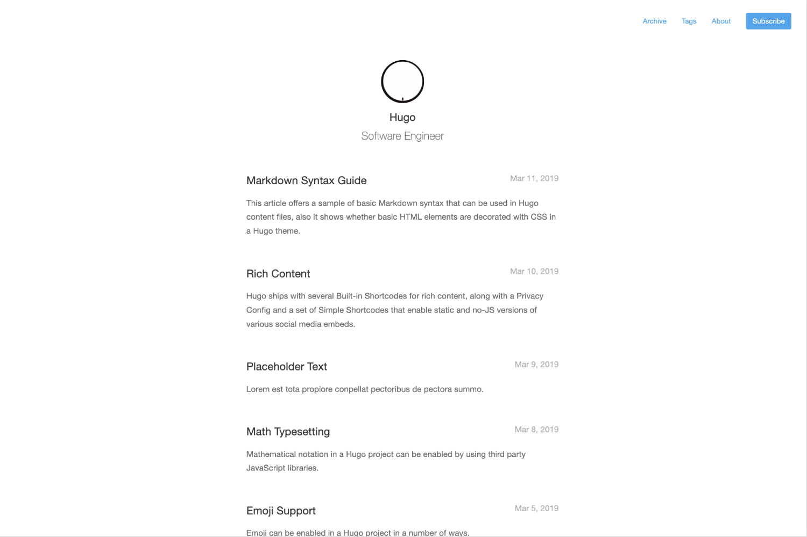

# Hugo Theme Mini

A fast, minimalist and responsive hugo theme.




- [Online demo](nodejh.github.io/hugo-theme-mini)
- [Example Site](exampleSite)

Features:

- Fast
- Minimalist
- Responsive
- Archive
- Tags


## Installation


### As a Hugo Module (recommended)

> ⚠️ If you installed a [Hugo binary](https://gohugo.io/getting-started/installing/#binary-cross-platform), you may not have Go installed on your machine. To check if Go is installed:
> ```
> $ go version
> ```
>  Go modules were considered production ready in v1.14. [Download Go](https://golang.org/dl/). 

1. From your project's root directory, initiate the hugo module system if you haven't already:

   ```
   $ hugo mod init github.com/<your_user>/<your_project>
   ```

2. Add the theme's repo to your `config.yaml`:

   ```yaml
   theme: 
     - github.com/nodejh/gohugo-theme-mini
   ```

### As Git Submodule

Inside the folder of your Hugo site run:

```
$ git submodule add https://github.com/nodejh/gohugo-theme-mini.git themes/mini
```
For more information read the official [setup guide](//gohugo.io/overview/installing/) of Hugo.


## Getting started

After installing the theme successfully it requires a just a few more steps to get your site running.


### The config file

Take a look inside the [`exampleSite`](https://github.com/nodejh/gohugo-theme-mini/tree/master/exampleSite) folder of this theme. You'll find a file called [`config.yaml`](https://github.com/nodejh/gohugo-theme-mini/blob/master/exampleSite/config.yaml). To use it, copy the [`config.yaml`](https://github.com/nodejh/gohugo-theme-mini/blob/master/exampleSite/config.yaml) in the root folder of your Hugo site. Feel free to change the strings in this theme.

You may need to delete the line: `themesDir: ../../`


### Logo and favicon

You can replace the log in the top of each page and favicon with your own images. To do that replace `static/images/avatar.png` and `static/images/favicon.ico` .


### Nearly finished

In order to see your site in action, run Hugo's built-in local server.

```sh
$ hugo server
```

Now enter localhost:1313 in the address bar of your browser.